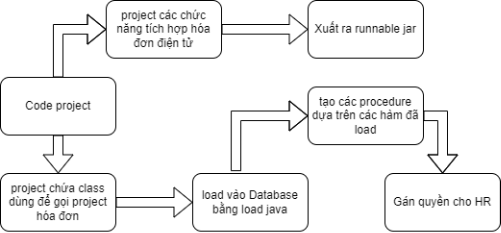
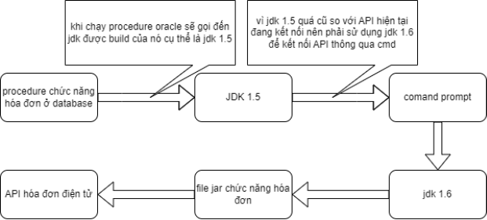
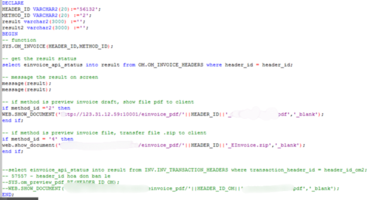

# **TÀI LIỆU HƯỚNG DẪN HÓA ĐƠN ĐIỆN TỬ TÍCH HỢP (bản demo của API)**

# **MỤC LỤC**

[1.	Các yếu tố môi trường của hệ thống (khi thực hiện tích hợp hóa đơn điện tử):](#_toc223193471)

[2.	Nguyên lý hoạt động của chức năng](#_toc223193472)

[3.	Class gọi file jar chức năng hóa đơn:](#_toc223193473)

[4.	Danh sách method_Id:](#_toc223193475)

[5. Chức năng ở mục OM](#_toc182235363)

[6.	Các bước cài đặt hóa đơn điện tử](#_toc223193476)

1. ## Các yếu tố môi trường của hệ thống (khi thực hiện tích hợp hóa đơn điện tử):
- JDK 1.6
- Indigo Eclipse
- Oracle Database 11.1.0.7
- Oracle Form 10g R2
- Toad
2. ## Nguyên lý hoạt động của chức năng
Yêu cầu chính: Từ phầm mềm Oracle Form gọi các chức năng để đưa dữ liệu từ database đến API Viettel mà các chức năng của Oracle Form chủ yếu từ database nên dựa theo hướng này để thực hiện gọi API từ database

Ý tưởng thực hiện tổng quát:

- Các project java phụ trách xử lý cho dữ liệu của từng nghiệp vụ ERP ( OM, PO, INV, AR) à export các project ra các file runnable jar tương ứng và database sử dụng cmd để gọi file jar để gọi API.
- Để database có thể gọi file jar thì phải load các class của project vào database và dựa vào đó tạo procedure. Cuối cùng, gán quyền cho HR thì chức năng có thể khai báo và sử dụng ở Oracle Form.

  

Các nguyên lý hoạt động của chức năng

Thư viện đã sử dụng:

- OJDBC5
- Common-io 2.2
- Json-20140107
- Common-codec-1.6
- Jdic-all
- Jdk1.6 (dùng làm môi trường chạy và thử nghiệm)

3. ## Class gọi file jar chức năng hóa đơn:
Class này được tạo lên với các hàm gọi file jar chạy trên môi trường jdk 1.6 thông qua command prompt.

Mẫu cmd trong code: 

String[] command = { "cmd", "/k",

`				`"E:\\EINVOICE\\plugin\\jdk1.6.0\_45\\bin\\java.exe",

`				`"-jar", "E:\\EINVOICE\\OM\_INVOICE.jar", header\_id, method\_id };

Đường dẫn đến jdk1.6: 

"E:\\EINVOICE\\plugin\\jdk1.6.0\_45\\bin\\java.exe"

Đường dẫn đến file jar được xuất ra: "E:\\EINVOICE\\OM\_INVOICE.jar"

Thông số đưa vào: header\_id, method\_id
4. ### Danh sách method\_Id:

|method\_id|Chức năng|
| :- | :- |
|1|Lập hóa đơn nháp|
|2|Xem trước hóa đơn nháp (.pdf)|
|3|Phát hành hóa đơn|
|4|Xem file hóa đơn đã phát hành là .zip( chứa file .xml, .xsl)|

Danh sách được lưu trong bảng HR.HR\_EINVOICE\_METHOD:

`	`
5. #### Chức năng ở mục OM:
Tên: SYS.OM\_INVOICE

Mô tả: hàm này sẽ lấy 2 thông số đầu vào là:

- header\_id ( kiểu dữ liệu varchar2) trong bảng OM.OM\_INVOICE\_HEADERS.
- Method\_id (kiểu dữ liệu varchar2)( ví dụ: ‘1’,’2’,...) theo mục 3. ở trên.

Cột hiện thị trạng thái khi sau khi gọi API: einvoice\_api\_status trong bảng OM.OM\_INVOICE\_HEADERS. (được lưu theo header\_id)

Cách sử dụng:  

- Chỉ cần thay đổi header\_id thì hàm sẽ lấy thông tin hóa đơn của chức năng đó trong database và gửi lên hóa đơn điện tử viettel
- Lỗi có thể xảy ra có các nguyên nhân sau: 
  - Mã số thuế của người mua sai( hóa đơn điện tử xác định mã số thuế của người mua theo mã số thuế thật)
  - Nếu hóa đơn không hiện như header\_id (56132) có thể là vì hóa đơn này đã phát hành nên không thể tạo thông tin hóa đơn nháp.

Cách tra cứu:

- đăng nhập vào tài khoản ở đường link sau đó truy cập ở mục hóa đơn chưa phát hành trong thư mục hóa đơn chưa phát hành.
- Nếu hóa đơn nháp được tạo ngày nào thì sẽ được lưu lúc đó
6. ## Các bước cài đặt hóa đơn điện tử
Bước 1: Sử dụng java manager để load file java ở trong thư mục .. chọn file runOnOtherJDK.java ở thư mục src và runOnOtherJDK.class ở thư mục bin

Lưu ý: thư mục code nằm trong E:\EINVOICE\workspace

Bước 2: mở Editor và tạo procedure cho 4 chức năng:

- OM\_INVOICE
- AR\_INVOICE
- PO\_INVOICE
- INV\_INVOICE

Thay thế các tên lần lượt vào câu lệnh sau: ( ví dụ ở đây là AR\_INVOICE)

CREATE OR REPLACE PROCEDURE SYS.AR\_INVOICE (HEADER\_ID VARCHAR2, METHOD\_ID VARCHAR2) 

` `AS LANGUAGE JAVA NAME 

'runOnOtherJDK.AR\_INVOICE(java.lang.String, java.lang.String)'

GRANT EXECUTE ON SYS.AR\_INVOICE TO HR 

