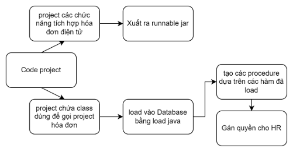
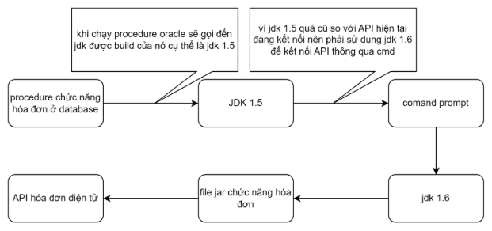
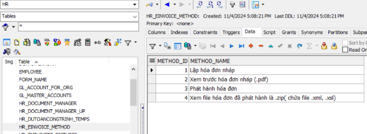
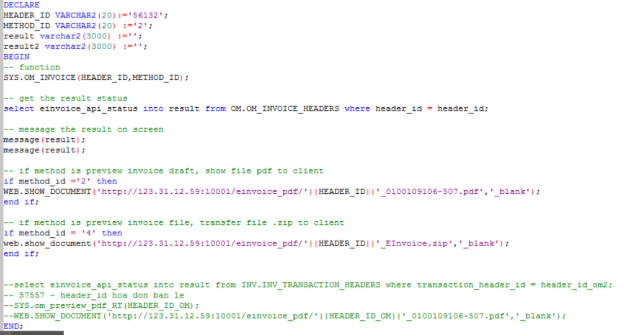
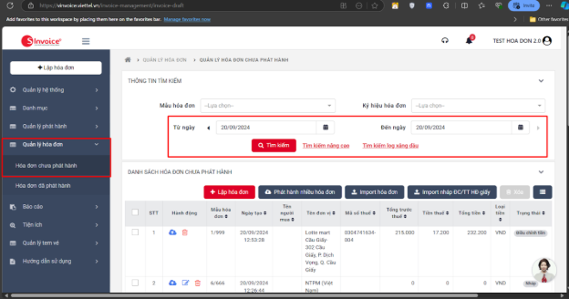
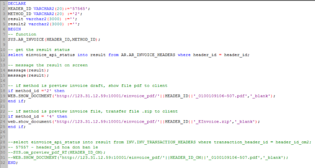
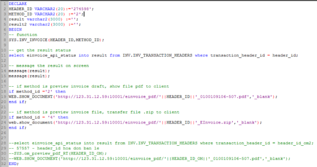
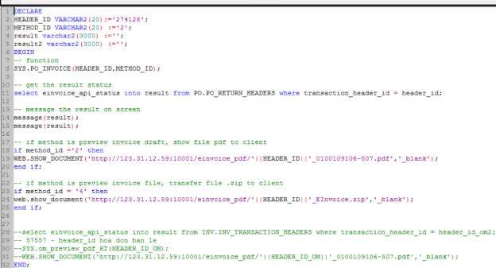

# **TÀI LIỆU HƯỚNG DẪN HÓA ĐƠN ĐIỆN TỬ TÍCH HỢP (bản demo của API)**

# **MỤC LỤC**
[TÀI LIỆU HƯỚNG DẪN HÓA ĐƠN ĐIỆN TỬ TÍCH HỢP (bản demo của API)	1](#_toc182235462)

[MỤC LỤC	2](#_toc182235463)

[1.	Các yếu tố môi trường của hệ thống (khi thực hiện tích hợp hóa đơn điện tử):	4](#_toc182235464)

[2.	Nguyên lý hoạt động của chức năng	4](#_toc182235465)

[3.	Thông tin chi tiết về project code	5](#_toc182235466)

[3.1	Nghiệp vụ OM:	5](#_toc182235467)

[3.1.1	General info (thông tin chung của hóa đơn):	5](#_toc182235468)

[3.1.2	Seller info (thông tin người bán):	7](#_toc182235469)

[3.1.3	buyer info ( thông tin người mua):	9](#_toc182235470)

[3.1.4	Payments info (thông tin thanh toán):	11](#_toc182235471)

[3.1.5	item info (thông tin đơn hàng):	11](#_toc182235472)

[3.1.6	taxBreakdowns (thông tin tổng hợp thuế suất):	13](#_toc182235473)

[3.1.7	summarize info ( thông tin tổng hợp tiền hàng cho toàn bộ hóa đơn):	13](#_toc182235474)

[3.1.8	meta data( Thông tin trường bổ sung):	14](#_toc182235475)

[3.1.9	meterReading (Thông tin đặc thù cho riêng hóa đơn điện/nước):	14](#_toc182235476)

[3.1.10	invoice File (file đính kèm khi lập hóa đơn):	14](#_toc182235477)

[3.1.11	qrcode:	14](#_toc182235478)

[3.1.12	fuelReading:	14](#_toc182235479)

[3.1.13	Hàm tạo chuỗi json:	14](#_toc182235480)

[3.2	Class gọi file jar chức năng hóa đơn:	14](#_toc182235481)

[4.	Thông tin về các chức năng:	15](#_toc182235482)

[4.1	Danh sách method_Id:	15](#_toc182235483)

[4.2 Chức năng ở mục OM:	16](#_toc182235484)

[4.3 Chức năng ở mục AR:	17](#_toc182235485)

[4.4 Chức năng mục INV:	18](#_toc182235486)

[4.5 Chức năng mục PO:	20](#_toc182235487)

[4.6 Thông tin in hóa đơn:	21](#_toc182235488)

**\

1. ## Các yếu tố môi trường của hệ thống (khi thực hiện tích hợp hóa đơn điện tử):
- JDK 1.6
- Indigo Eclipse
- Oracle Database 11.1.0.7

Thông tin đăng nhập hóa đơn điện tử Viettel (demo):

- Địa chỉ: [viettel vinvoice](https://vinvoice.viettel.vn/)
- Tài khoản: 0100109106-507
- Mật khẩu: 2wsxCDE#

Đây là thông tin tài khoản hóa đơn điện tử demo của Viettel, em để ở đây để mình có thể đăng nhập vào và test.
1. ## Nguyên lý hoạt động của chức năng
Các bước thực hiện tổng quát

Các nguyên lý chạy của chức năng

1. ## Thông tin chi tiết về project code
Lưu ý: 

- Mỗi nghiệp vụ là một project khác nhau, vì hiện tại có 4 nghiệp vụ nên có 4 project được cấu hình riêng cho mỗi nghiệp vụ.
- Project code có 2 phần chính là code về chức năng hóa đơn để xuất ra file jar và code về class gọi file jar được xuất ra

Thư viện cần thiết:

- OJDBC5
- Common-io 2.2
- Json-20140107
- Common-codec-1.6
- Jdic-all
- Jdk1.6 (dùng làm môi trường chạy và thử nghiệm)

Sử dụng nghiệp vụ OM làm ví dụ, các nghiệp vụ khác sẽ khác nhau vì nghie
1. ### Nghiệp vụ OM:
Tham khảo chương 6 của tài liệu mô tả webservice hóa đơn điện tử Viettel
1. #### General info (thông tin chung của hóa đơn):
Bảng thông tin API Viettel yêu cầu:

|Tên cột|Cột ở database|Chi tiết|
| :- | :- | :- |
|transactionUuid|
TRANSACTION\_NUMBER

Table: om.om\_invoice\_headers
||
|invoiceType|
INVOICE\_TYPE

Table: om.om\_invoice\_headers	
|Chuyển từ dạng chữ sang dạng số|
|templateCode|
1/00834

Table: om.om\_invoice\_headers
|Default theo demo|
|invoiceSeries|
K24TGM

Table: om.om\_invoice\_headers
|Default theo demo|
|currencyCode|
CURRENCY\_CODE

Table: om.om\_invoice\_headers
||
|exchangeRate|
RATE	

Table: om.om\_invoice\_headers
||
|adjustmentType|1|Tùy chỉnh|
|paymentStatus|
STATUS

Table: ar.ar\_invoice\_headers
|Trạng thái trên hệ thống là Complete và Incomplete chuyển đổi thành true và false|
|cusGetInvoiceRight|True|Tùy chỉnh|

1. #### Seller info (thông tin người bán):

|Tên trường|Cột ở database|Mô tả|
| :- | :- | :- |
|sellerLegalName|
VS\_SITE\_NAME

table: hr.sys\_master\_site\_ven\_cus
||
|sellerTaxCode|0100109106-507|Default theo demo|
|sellerAddressLine|
ADDRESS\_LINE1

table: hr.sys\_master\_site\_ven\_cus
||
|sellerPhoneNumber|
PHONE

table: hr.sys\_master\_site\_ven\_cus
||
|sellerFaxNumber|
FAX	

table: hr.sys\_master\_site\_ven\_cus
||
|sellerEmail|
EMAIL

table: hr.sys\_master\_site\_ven\_cus
||
|sellerBankName|||
|sellerBankAccount|
BANK\_NAME

Table: hr.sys\_master\_vs\_banks
||
|sellerDistrictName|
BANK\_ACCOUNT\_NUM

Table: hr.sys\_master\_vs\_banks
||
|sellerCityName|
CITY

table: hr.sys\_master\_site\_ven\_cus
||
|sellerCountryCode|
COUNTRY\_CODE

table: hr.sys\_master\_site\_ven\_cus
||
|sellerWebsite|verp.com.vn||
1. #### buyer info ( thông tin người mua):

|Tên trường|Cột ở database|Mô tả|
| :- | :- | :- |
|buyerLegalName|
VS\_SITE\_NAME

table: hr.sys\_master\_site\_ven\_cus
||
|buyerTaxCode|0101925883|Default theo demo|
|buyerAddressLine|
ADDRESS\_LINE1

table: hr.sys\_master\_site\_ven\_cus
||
|buyerPostalCode|
ZIP

table: hr.sys\_master\_site\_ven\_cus
||
|buyerCityName|||
|buyerPhoneNumber|
PHONE

table: hr.sys\_master\_site\_ven\_cus
||
|buyerFaxNumber|
FAX	

table: hr.sys\_master\_site\_ven\_cus
||
|buyerEmail|
EMAIL

table: hr.sys\_master\_site\_ven\_cus
||
|buyerBankName|
BANK\_NAME

Table: hr.sys\_master\_vs\_banks
||
|buyerBankAccount|
BANK\_ACCOUNT\_NUM

Table: hr.sys\_master\_vs\_banks
||
|buyerDistrictName|||
|buyerCityName|
CITY

table: hr.sys\_master\_site\_ven\_cus
||
|buyerCountryCode|
COUNTRY\_CODE

table: hr.sys\_master\_site\_ven\_cus
||
1. #### Payments info (thông tin thanh toán):

|Tên trường|Cột ở database|Chi tiết|
| :- | :- | :- |
|paymentMethod|2|Default, nếu khác xem trong tài liệu mô tả  của Viettel|
|paymentMethodName|CK||
1. #### item info (thông tin đơn hàng):

|Tên trường|Cột ở database|Chi tiết|
| :- | :- | :- |
|lineNumber|||
|itemCode|
ITEM\_ID

Table: om.om\_invoice\_lines
||
|itemName|
ITEM\_NAME

Table: om.om\_invoice\_lines
||
|unitName|
UOM

Table: om.om\_invoice\_lines
||
|itemNote|||
|unitPrice|
PRICE

Table: om.om\_invoice\_lines
||
|quantity|||
|itemTotalAmountWithoutTax|
AMOUNT

Table: om.om\_invoice\_lines
||
|itemTotalAmountWithTax|||
|itemTotalAmountAfterDiscount|||
|taxPercentage|
RATE

Table:

po.po\_taxes
||
|taxAmount|
TAX\_AMOUNT

Table: om.om\_invoice\_lines
||
|customTaxAmount|||
|discount|||
|itemDiscount|
DISCOUNT\_AMOUNT

Table: om.om\_invoice\_lines
||
1. #### taxBreakdowns (thông tin tổng hợp thuế suất):

|Tên trường|Cột ở database|Chi tiết|
| :- | :- | :- |
|taxPercentage|
taxPercentage

from: item info
||
|taxableAmount|
itemTotalAmountWithoutTax

from: item info
||
|taxAmount|
taxAmount

from: item info
||
1. #### summarize info ( thông tin tổng hợp tiền hàng cho toàn bộ hóa đơn):

|Tên trường|Cột ở database|Chi tiết|
| :- | :- | :- |
|sumOfTotalLineAmountWithoutTax|||
|totalAmountWithoutTax|||
|totalTaxAmount|||
|totalAmountWithTax|||
|totalAmountAfterDiscount|||
|discountAmount|||
|extraName|||
|extraValue|||
1. #### meta data( Thông tin trường bổ sung):
1. #### meterReading (Thông tin đặc thù cho riêng hóa đơn điện/nước):
1. #### invoice File (file đính kèm khi lập hóa đơn):
1. #### qrcode:
1. #### fuelReading:
1. #### Hàm tạo chuỗi json:
- Hàm json thông tin hóa đơn:
  - Tên: invoice\_draft
  - API sử dụng: lập hóa đơn nháp, xem trước hóa đơn nháp và phát hành hóa đơn.
- Hàm json thông tin hóa đơn:
  - Tên: invoice
  - API sử dụng: xem hóa đơn đã phát hành.
  1. ### Class gọi file jar chức năng hóa đơn:
Class này được tạo lên với các hàm gọi file jar chạy trên môi trường jdk 1.6 thông qua command prompt.

Mẫu cmd trong code: 

String[] command = { "cmd", "/k",

`				`"E:\\FORMS\\EINVOICE\\plugin\\jdk1.6.0\_45\\bin\\java.exe",

`				`"-jar", "E:\\FORMS\\EINVOICE\\OM\_INVOICE.jar", header\_id, method\_id };

Đường dẫn đến jdk1.6: 

"E:\\FORMS\\EINVOICE\\plugin\\jdk1.6.0\_45\\bin\\java.exe"

Đường dẫn đến file jar được xuất ra: "E:\\FORMS\\EINVOICE\\OM\_INVOICE.jar"

Thông số đưa vào: header\_id, method\_id
1. ## Thông tin về các chức năng:
   1. ### Danh sách method\_Id:

|method\_id|Chức năng|
| :- | :- |
|1|Lập hóa đơn nháp|
|2|Xem trước hóa đơn nháp (.pdf)|
|3|Phát hành hóa đơn|
|4|Xem file hóa đơn đã phát hành là .zip( chứa file .xml, .xsl)|

Danh sách được lưu trong bảng HR.HR\_EINVOICE\_METHOD:

`	`
### 4.2 Chức năng ở mục OM:
Tên: SYS.OM\_INVOICE

Mô tả: hàm này sẽ lấy 2 thông số đầu vào là:

- header\_id ( kiểu dữ liệu varchar2) trong bảng OM.OM\_INVOICE\_HEADERS.
- Method\_id (kiểu dữ liệu varchar2)( ví dụ: ‘1’,’2’,...) theo mục 3. ở trên.

Cột hiện thị trạng thái khi sau khi gọi API: einvoice\_api\_status trong bảng OM.OM\_INVOICE\_HEADERS. (được lưu theo header\_id)

Cách sử dụng:  

- Chỉ cần thay đổi header\_id thì hàm sẽ lấy thông tin hóa đơn của chức năng đó trong database và gửi lên hóa đơn điện tử viettel
- Lỗi có thể xảy ra (tốt nhất là liên lạc em để có thể xác định rõ vì form ko hiện ra) có các nguyên nhân sau: 
  - Mã số thuế của người mua sai( hóa đơn điện tử xác định mã số thuế của người mua theo mã số thuế thật)
  - Nếu hóa đơn không hiện như header\_id (56132) có thể là vì hóa đơn này đã phát hành nên không thể tạo thông tin hóa đơn nháp.

Cách tra cứu:

- đăng nhập vào tài khoản ở đường link sau đó truy cập ở mục hóa đơn chưa phát hành trong thư mục hóa đơn chưa phát hành.
- Nếu hóa đơn nháp được tạo ngày nào thì sẽ được lưu lúc đó

\
\
\

### 4.3 Chức năng ở mục AR:
Tên: SYS.AR\_INVOICE

Mô tả: hàm này sẽ lấy 2 thông số đầu vào là:

- header\_id ( kiểu dữ liệu varchar2) trong bảng AR.AR\_INVOICE\_HEADERS.
- Method\_id (kiểu dữ liệu varchar2)( ví dụ: ‘1’,’2’,...) theo mục 3. ở trên.

Cột hiện thị trạng thái khi sau khi gọi API: einvoice\_api\_status trong bảng AR.AR\_INVOICE\_HEADERS. (được lưu theo header\_id)

Cách sử dụng:  

- Theo ví dụ thì hàm sẽ được gọi như thế này: 

SYS.AR\_INVOICE(‘57565’,’’2’);

\

### 4.4 Chức năng mục INV: 
(tình trạng: hoàn thành đa phần, vì chưa được quyết định về thuế và trạng thái thanh toán)

Tên: SYS.INV\_INVOICE

Mô tả: hàm này sẽ lấy 2 thông số đầu vào là:

- transaction\_header\_id ( kiểu dữ liệu varchar2) trong bảng INV.INV\_TRANSACTION\_HEADERS.
- Method\_id (kiểu dữ liệu varchar2)( ví dụ: ‘1’,’2’,...) theo mục 3. ở trên.

Cột hiện thị trạng thái khi sau khi gọi API: einvoice\_api\_status trong bảng INV.INV\_TRANSACTION\_HEADERS. (được lưu theo transaction\_header\_id)

Cách sử dụng:  

- Theo ví dụ thì hàm sẽ được gọi như thế này: 

SYS.INV\_INVOICE(‘274598’,’’2’);

\

### 4.5 Chức năng mục PO: 
(tình trạng: hoàn thành đa phần, chưa quyết định thuế và trạng thái thanh toán)

Tên chức năng: SYS.PO\_INVOICE

Mô tả: hàm này sẽ lấy 2 thông số đầu vào là:

- transaction\_header\_id ( kiểu dữ liệu varchar2) trong bảng PO.PO\_RETURN\_HEADERS.
- Method\_id (kiểu dữ liệu varchar2)( ví dụ: ‘1’,’2’,...) theo mục 3. ở trên.

Cột hiện thị trạng thái sau khi gọi API: einvoice\_api\_status trong bảng INV.INV\_TRANSACTION\_HEADERS. (được lưu theo transaction\_header\_id)

Cách sử dụng:  

- Theo ví dụ thì hàm sẽ được gọi như thế này: 

SYS.PO\_INVOICE(‘274128’,’2’);

### 4.6 Thông tin in hóa đơn:
Địa chỉ ip sử dụng: <http://123.31.12.59:10001/> ( tương ứng với đi tới thư mục E:\Report\)

Hóa đơn sẽ được lưu trong thư mục E:\Report\einvoice\_pdf\
1. ## Các bước cài đặt hóa đơn điện tử
Bước 1: Sử dụng java manager để load file java ở trong thư mục .. chọn file runOnOtherJDK.java ở thư mục src và runOnOtherJDK.class ở thư mục bin

Lưu ý: thư mục code nằm trong E:\FORMS\EINVOICE\workspace

Bước 2: mở Editor và tạo procedure cho 4 chức năng:

- OM\_INVOICE
- AR\_INVOICE
- PO\_INVOICE
- INV\_INVOICE

Thay thế các tên lần lượt vào câu lệnh sau:

CREATE OR REPLACE PROCEDURE SYS.AR\_INVOICE (HEADER\_ID VARCHAR2, METHOD\_ID VARCHAR2) 

` `AS LANGUAGE JAVA NAME 

'runOnOtherJDK.AR\_INVOICE(java.lang.String, java.lang.String)'

GRANT EXECUTE ON SYS.AR\_INVOICE TO HR 

